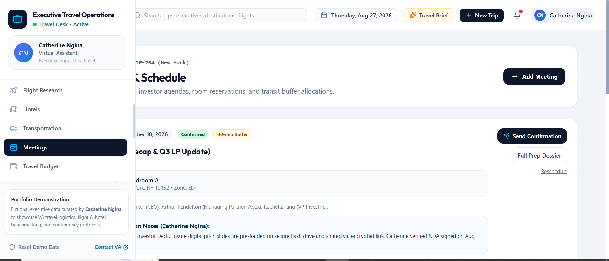
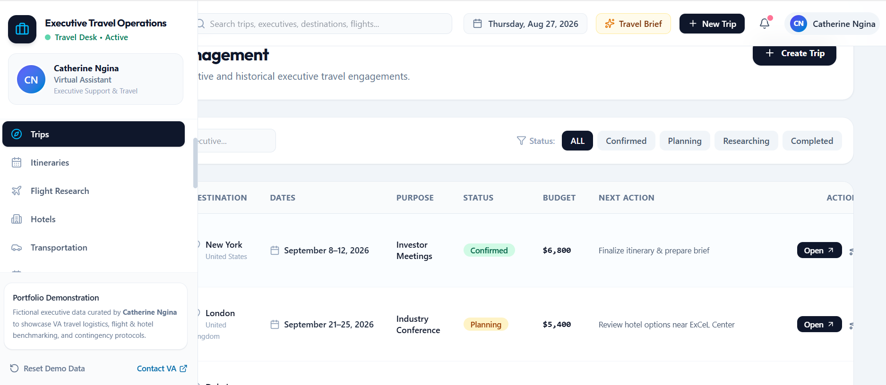

# ✈️ Executive Travel Planning & Logistics Hub

### Virtual Assistant Portfolio Project

A professional executive travel coordination workspace demonstrating how a Virtual Assistant can support business travel research, itinerary planning, accommodation coordination, transportation, meeting scheduling, travel budgets, follow-ups, and executive travel briefs.

> **Portfolio Demo:** This project uses fictional sample data and does not represent real clients, customers, or personal information.

---
## 📸 Project Screenshots

### Executive Travel Operations Dashboard

### Flight Research

### Meetings

### Travel Budget

### Trips

---

## 📌 Project Overview

This project demonstrates a structured executive travel coordination workflow managed by a Virtual Assistant.

The workspace brings travel research, itinerary planning, accommodation comparison, transportation coordination, meeting scheduling, budget tracking, follow-ups, document organization, and reporting into one organized system.

The goal is to demonstrate how a Virtual Assistant can reduce the administrative workload associated with business travel while keeping schedules, logistics, budgets, and important travel information organized.

---

## 🎯 Objectives

- Research business travel options
- Compare flights and accommodation
- Create detailed executive itineraries
- Coordinate airport transportation
- Schedule business meetings
- Track travel budgets
- Manage travel-related follow-ups
- Organize travel documents
- Prepare executive travel briefs
- Identify potential travel risks
- Maintain organized travel records
- Monitor travel planning progress

---

## ⚙️ Key Features

### ✈️ Flight Research
- Flight comparison
- Departure and arrival times
- Travel duration
- Stopover comparison
- Business-class options
- Price comparison
- Recommended flight selection

### 🏨 Hotel Research
- Hotel comparison
- Nightly rates
- Location
- Meeting proximity
- Amenities
- Cancellation policies
- Shortlisting

### 🗓️ Executive Itinerary
- Day-by-day schedule
- Flight information
- Hotel information
- Transportation
- Business meetings
- Important reminders
- Travel timeline

### 🚗 Transportation Coordination
- Airport transfers
- Executive car services
- Pickup and drop-off details
- Driver information
- Transportation status
- Confirmation tracking

### 📅 Meeting Coordination
- Business meetings
- Meeting locations
- Attendees
- Time-zone coordination
- Preparation notes
- Schedule buffers
- Meeting confirmations

### 💰 Travel Budget Management
- Flight costs
- Hotel costs
- Transportation
- Meals
- Meeting expenses
- Contingency budget
- Remaining budget

### 🔔 Follow-Up Management
- Vendor follow-ups
- Travel confirmations
- Meeting confirmations
- Due dates
- Priority tracking
- Completed follow-ups

### 📄 Document Management
- Flight confirmations
- Hotel confirmations
- Executive itinerary
- Meeting agenda
- Travel brief
- Travel insurance
- Expense summary

### 📊 Reporting
- Trips managed
- Travel spending
- Flights researched
- Hotels compared
- Meetings coordinated
- Follow-up completion
- Planning performance

---

## 🔄 Executive Travel Workflow

Travel Request
↓
Travel Research
↓
Flight Comparison
↓
Hotel Research
↓
Transportation Planning
↓
Meeting Coordination
↓
Budget Review
↓
Itinerary Preparation
↓
Executive Travel Brief
↓
Follow-Up & Confirmation

---

## 🧰 Skills Demonstrated

- Executive Assistance
- Travel Research
- Itinerary Planning
- Calendar & Schedule Coordination
- Meeting Coordination
- Administrative Support
- Budget Tracking
- Vendor Follow-Up
- Data Management
- Document Organization
- Research & Comparison
- Reporting & Documentation
- Time-Zone Coordination

---

## 💻 Technology

- React
- TypeScript
- Vite
- Tailwind CSS
- Local Sample Data
- Responsive UI Design

---

## 👩🏽‍💻 Portfolio Context

**Created by Catherine Ngina**

Virtual Assistant | Executive Support & Travel Coordination

This fictional portfolio project demonstrates practical executive-assistance and travel-coordination workflows.

---

## 📄 Disclaimer

This is a fictional portfolio demonstration. All executives, companies, travel details, prices, bookings, meetings, and operational records are sample data created for demonstration purposes only.
